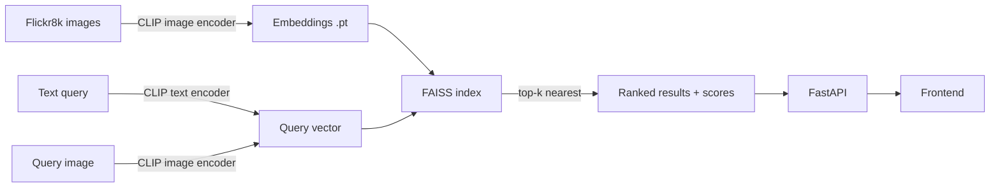

# flickr8k-clip

A text-to-image and image-to-image search engine built on the [Flickr8k](https://www.kaggle.com/datasets/adityajn105/flickr8k) dataset, powered by [CLIP](https://openai.com/research/clip) embeddings and [FAISS](https://github.com/facebookresearch/faiss) similarity search. Every image in the dataset is encoded once into a CLIP embedding; at query time a text prompt (or another image) is encoded the same way and FAISS returns the closest matches by cosine similarity.


## How it works



1. **Embedding** — every dataset image is passed through CLIP's image encoder once and cached to disk (`outputs/embeddings.pt`).
2. **Indexing** — the embedding matrix is L2-normalized and loaded into a FAISS `IndexFlatIP` index (inner product on normalized vectors = cosine similarity).
3. **Querying** — a text prompt or uploaded image is encoded with the matching CLIP encoder, then FAISS returns the `k` nearest image vectors along with their similarity scores.
4. **Serving** — a FastAPI backend wraps the index and exposes search endpoints; a small vanilla JS frontend calls them and renders the results with their scores.

## Features

- Text → image search (`"a dog running on the beach"` → matching photos)
- Image → image search (upload a photo, find visually similar ones)
- Uploaded images are added to the dataset — embedded, saved to disk, and indexed so future searches can match against them too
- Image captioning & visual Q&A powered by [Moondream2](https://huggingface.co/vikhyatk/moondream2) — describe any result image or ask a question about it
- Similarity score shown under every result
- FAISS-backed nearest neighbor search for fast lookups
- Minimal FastAPI backend + vanilla JS frontend, no heavy framework

## Project structure

```
flickr8k-clip/
├── model/                  # symlink to a local CLIP model (clip-vit-base-patch32)
├── images/                 # screenshots / diagrams used in this README
├── outputs/                # generated embeddings, FAISS index, preview images
├── frontend/                # search UI (HTML/CSS/JS)
│   ├── index.html
│   ├── script.js
│   └── style.css
└── src/
    ├── model_loader.py      # loads CLIP model + processor (cached)
    ├── moondream_loader.py  # loads Moondream2 VLM (cached) for captioning + Q&A
    ├── embeddings.py        # encodes all dataset images -> outputs/embeddings.pt
    ├── search.py             # CLI: build/load FAISS index, run a text search
    ├── check_dataset.py     # preview grid of random images + captions
    ├── inspect_embeddings.py # inspect saved embedding tensors
    ├── utils.py              # cosine similarity helper
    └── api.py                # FastAPI server (search + captioning endpoints)
```

## Setup

```bash
python3 -m venv venv
source venv/bin/activate
pip install -r requirements.txt
```

`model/` is a symlink pointing to a local CLIP model (`clip-vit-base-patch32`). Update this link to your own model path, or download the model from Hugging Face and place it at the same location.

## Dataset

Place the [Flickr8k](https://www.kaggle.com/datasets/adityajn105/flickr8k) dataset's `Images/` folder and `captions.txt` file under `~/Desktop/archive/` (the code uses this path by default).

## Usage

```bash
# Visualize random samples from the dataset with their captions
python3 src/check_dataset.py

# Compute and save CLIP embeddings for all images
python3 src/embeddings.py

# Search for the most similar images to a text query (FAISS, CLI)
python3 src/search.py
```

`search.py` prompts for a query, builds (or loads) the FAISS index, prints the top 5 matches with their similarity scores and timing, and saves the best match to `outputs/search_result.png`:

```
Search: a cat sitting on a chair
1. 1234567890.jpg (score:  0.3182)
2. 2345678901.jpg (score:  0.3021)
...
Indexing time: 12.40 ms
Search time: 0.85 ms
Saved: outputs/search_result.png
```


## Outputs

| File | Description |
|---|---|
| `outputs/embeddings.pt` | image filename → CLIP embedding vector |
| `outputs/faiss.index` | FAISS index used for search |
| `outputs/dataset_check.png` | dataset preview grid |
| `outputs/search_result.png` | best match for the last CLI search query |

## API server

```bash
uvicorn src.api:app --reload
```

On startup the server loads the CLIP model, the Moondream2 model, the cached embeddings, and the FAISS index once, and keeps them in memory for all requests.

| Endpoint | Method | Description |
|---|---|---|
| `/search` | `POST` | JSON body `{ "query": "a dog running", "k": 5 }` → top `k` matches |
| `/search-image?q=...` | `GET` | text query via query string → top 6 matches |
| `/search-by-image` | `POST` | multipart upload (`file`) → top 6 visually similar images |
| `/describe/{filename}` | `GET` | Moondream2 short caption for an image |
| `/ask/{filename}?q=...` | `GET` | Moondream2 visual Q&A — ask a question about an image |
| `/download/{filename}` | `GET` | download a source image |
| `/images/{filename}` | `GET` | static image files |

Each search result includes a `filename`, a cosine similarity `score`, and an `image_url` ready to render.

`/search-by-image` also grows the dataset: the uploaded image is saved into `IMAGES_DIR`, its CLIP embedding is added to `outputs/embeddings.pt`, and it's inserted into the FAISS index — so it becomes searchable in future queries too.

Example:

```bash
curl "http://localhost:8000/search-image?q=a cat sitting on a chair"
```

```json
{
  "results": [
    { "filename": "1234567890.jpg", "score": 0.3182, "image_url": "http://127.0.0.1:8000/images/1234567890.jpg" }
  ]
}
```

## Frontend

A small vanilla JS + CSS UI lives in `frontend/` for text and image search against the API. Each result card shows the image together with its similarity score, and opening an image lets you get a Moondream2 caption or ask a question about it.

```bash
cd frontend
npm install
npm run build   # or `npm run watch` while developing
```

Then open `frontend/index.html` in a browser (with the API server running on `localhost:8000`).
